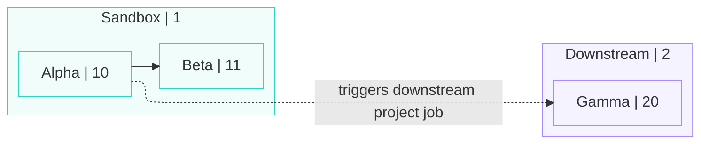

# Map dbt Cloud jobs as a DAG

## Context

dbt Cloud exposes **model** lineage (DAG of models) separately from **job** orchestration. Job-to-job dependencies—especially **run when another job completes**—appear on the job definition as `job_completion_trigger_condition`, not in model DAG metadata. This skill produces a **job DAG** from Admin API data via [`dbtp`](https://github.com/dbt-labs/dbt-rust-sdk) (dbt Platform CLI).

## What this captures vs. what it does not

| Captured | Not inferred from this API alone |
|----------|-----------------------------------|
| Edges from **job completion** triggers (`job_completion_trigger_condition`) | Implicit ordering from identical cron schedules |
| Job identity: `id`, `name`, `project_id`, `account_id`, `environment_id` | External orchestrators (Airflow, CI) calling the API |
| Optional node metadata: `execute_steps`, `settings.target_name`, `deactivated`, `triggers` | Model-level lineage (use skill `creating-mermaid-dbt-dag` or MCP lineage tools) |

## Prerequisites

### Install `dbtp` (dbt Platform CLI)

This workflow uses the **`dbtp`** command from the **[dbt Rust SDK](https://github.com/dbt-labs/dbt-rust-sdk)** repo (`dbt-labs/dbt-rust-sdk` on GitHub). The binary name is **`dbtp`** (easy to mistype as `dbtfp`). There is no separate “dbt-rusk-sdk”—that name is a typo for **Rust**.

1. Install a [Rust toolchain](https://rustup.rs/) if needed.
2. Follow the **dbt-rust-sdk** README for the current install path. Typical options:
   - `cargo install dbtp` **if** the crate is published to crates.io as documented there, or
   - Clone the repo and `cargo install --path <path-to-dbtp-crate>` as the README specifies.
3. Ensure the install directory is on `PATH` (often `~/.cargo/bin`). Verify with `dbtp --version`.

If `dbtp` is missing in the agent environment, tell the user to install it from dbt-rust-sdk before running list/get commands.

### API access

- Env vars (or flags): `DBT_TOKEN`, `DBT_ACCOUNT_ID`, and if not `cloud.getdbt.com`, `DBT_HOST` (e.g. `https://your-account.region.dbt.com`)
- Token must allow **Admin API** job read access

Do not paste secrets into chat or commit them. Use `.env` or the agent runtime secret store.

## Workflow

### 1. Confirm scope with the user

- **Whole account**: all active jobs under `DBT_ACCOUNT_ID`
- **One project**: same flow but pass `--project-id <id>` on `jobs list`

### 2. List jobs (paginated)

`jobs list` returns job summaries **without** `job_completion_trigger_condition`. Use it for **full job IDs**, names, and pagination.

```bash
dbtp jobs list --account-id "$DBT_ACCOUNT_ID" -o json --limit 100 --offset 0
# Optional: --project-id 123456
```

Repeat with `--offset 100`, `200`, … until `extra.pagination.count` is `0` or you have reached `extra.pagination.total_count`.

From each response, collect every `data[].id` (and keep `name`, `project_id`, `environment_id`, `deactivated` for node labels).

Collect the distinct set of `project_id` values for subgraph titles.

### 2b. Resolve project names (subgraph titles)

For **each** distinct `project_id` in scope:

```bash
dbtp projects get --account-id "$DBT_ACCOUNT_ID" --id <PROJECT_ID> -o json
```

Use `data.name` as the project display name. Subgraph title format (see deliverables): `<name> | <project_id>`. If `name` is missing, fall back to `Project | <project_id>`.

**Sanitize** names before putting them inside Mermaid double-quoted titles or node labels (see deliverables). Do not rely on backslash escaping alone—remove problematic characters.

### 3. Fetch full definition per job

For each job id from step 2:

```bash
dbtp jobs get --account-id "$DBT_ACCOUNT_ID" --id <JOB_ID> -o json
```

Run requests in parallel if the environment allows (e.g. `xargs -P 8`) to reduce wall time.

### 4. Extract edges

For each **child** job (the job whose definition you fetched):

1. Read `data.job_completion_trigger_condition` if present.
2. Typical shape:

```json
"job_completion_trigger_condition": {
  "condition": {
    "job_id": 83771,
    "project_id": 89074,
    "statuses": [10]
  }
}
```

3. Add a directed edge **upstream → child**:

- **From** node `(project_id: condition.project_id, job_id: condition.job_id)` — the prerequisite job  
- **To** node `(project_id: child.project_id, job_id: child.id)` — the job you fetched  

`statuses` are numeric run outcomes (commonly `10` = success). Preserve them on the edge label or in edge metadata.

4. If the upstream job id is **outside** the collected set (deleted job or wrong scope), still record the edge and mark `upstream_missing_in_scope: true` on that edge.

5. Jobs with **no** `job_completion_trigger_condition` are **sources** in the job-DAG sense (no upstream edges from this mechanism); they still may run on schedule or webhooks.

### 5. Deliverables

**Coverage:** Include **every job in scope** in the diagram and in `nodes`—even if it has **no** incoming or outgoing completion-trigger edges (isolated nodes still appear inside the correct project subgraph).

Provide both:

**A. Structured graph (JSON)** — suitable for docs or tooling. One entry per job in scope; edges only where `job_completion_trigger_condition` exists:

```json
{
  "nodes": [
    {
      "job_id": 83771,
      "project_id": 89074,
      "name": "Nightly Build",
      "environment_id": 85030,
      "deactivated": false
    }
  ],
  "edges": [
    {
      "from": { "job_id": 83771, "project_id": 89074 },
      "to": { "job_id": 876837, "project_id": 323716 },
      "trigger": "job_completion",
      "statuses": [10]
    }
  ],
  "notes": [
    "Edges reflect job_completion_trigger_condition only."
  ]
}
```

**B. Mermaid diagram (`flowchart`)** — prefer **[Mermaid Live](https://mermaid.live)** with the **ELK** renderer, subgraph styling, and labeled cross-project edges (matches how dbt Cloud lineage reads visually).

| Rule | Detail |
|------|--------|
| **Sanitized labels** | Same cleanup on subgraph titles and job labels: remove `"`, `'`, `` ` ``, `#`; replace `[` / `]` with `(` / `)`; strip `<`, `>`, `&`, `*`; collapse whitespace. |
| **Init directive** | Start with `%%{init: …}%%`. Defaults that work well in Mermaid Live: `"defaultRenderer": "elk"`, `"htmlLabels": true`, `"nodeSpacing": 40`, `"rankSpacing": 25`, `"padding": 12`, `"useMaxWidth": false`. Fall back to `"dagre"` if ELK errors. |
| **Top-level direction** | `flowchart LR`. |
| **Nodes** | One node per job: visible **name ` \| ` job_id**; id `job_<job_id>`. |
| **Subgraph titles** | One subgraph per `project_id`: **name ` \| ` project_id** after sanitization (step **2b**). |
| **Subgraph order** | Project-level topological sort so downstream projects are declared **after** upstream donors. |
| **Order inside subgraph** | `direction TB`. Put **cross-project trigger sources** first, then a **topological walk** of **same-project** completion edges whose upstream is **not** already listed as a cross-project source, then remaining incident jobs, then all other jobs (ascending `job_id`). Do **not** add fake `~~~` chains unless the user explicitly wants layout-only spines. |
| **`classDef` / `class`** | After `flowchart LR`, define one `classDef` per project (stroke + fill). Typical two-project palette: **projectA** teal (`stroke:#2dd4bf,fill:#f0fdfa`), **projectB** purple (`stroke:#a78bfa,fill:#f5f3ff`). For three or more projects, add **projectC**, **projectD** (e.g. orange / sky) and rotate. Apply with `class proj_<id>,job_<id>,… projectX` — dedupe ids so each node appears once. |
| **Edges** | Completion triggers only. Same-project: `job_a --> job_b`. Cross-project: labeled dashed arrow, e.g. `job_a -. "triggers downstream project job" .-> job_b` (adjust text if the user prefers). |

Example (pattern only):



**C. `.mmd` file (optional)** — For [Mermaid Live](https://mermaid.live) or CLI renderers: write **UTF-8** plain text of the diagram only (no markdown code fence). A `%%` comment at the top is fine. From the `dbt-agent-skills` repo root you can run:

```bash
python3 skills/dbt-extras/skills/mapping-dbt-cloud-job-dag/scripts/export_job_dag.py \
  --project-id 89074 --project-id 323716 \
  -o skills/dbt-extras/skills/mapping-dbt-cloud-job-dag/job-dag-export.mmd \
  --renderer elk \
  --cross-project-label "triggers downstream project job"
```

(`DBT_TOKEN`, `DBT_ACCOUNT_ID`, `DBT_HOST` must be set; **`dbtp`** installed from **dbt-rust-sdk** and on `PATH`. Override binary with env `DBTP_PATH` if needed.)

If the graph is large, still emit every node; add prose **after** the diagram unless the user asks for a filtered view.

## jq sketch (optional)

After saving list payloads to files or piping, you can collect ids:

```bash
jq -r '.data[].id' list_page.json
```

Combine `jobs get` outputs and parse `job_completion_trigger_condition` similarly—exact jq depends on whether outputs are merged into one array or one file per job.

## Troubleshooting

| Issue | Action |
|-------|--------|
| `dbtp` / `command not found` | Install **`dbtp`** from [dbt-rust-sdk](https://github.com/dbt-labs/dbt-rust-sdk) (see Prerequisites); confirm `PATH` includes Cargo bin or symlink |
| `401` / auth errors | Verify `DBT_TOKEN` and host; PAT vs service token permissions |
| Empty `data` on list | Check `--project-id`, `DBT_ACCOUNT_ID`, and `--state active` |
| No edges | Account may only use schedules/webhooks—confirm in UI **Triggers → Run when another job completes** |
| Rate limits | Reduce parallel `jobs get`; backoff |

## Related

- **Model DAG / lineage**: skill `creating-mermaid-dbt-dag`
- **Failed runs**: skill `troubleshooting-dbt-job-errors`
