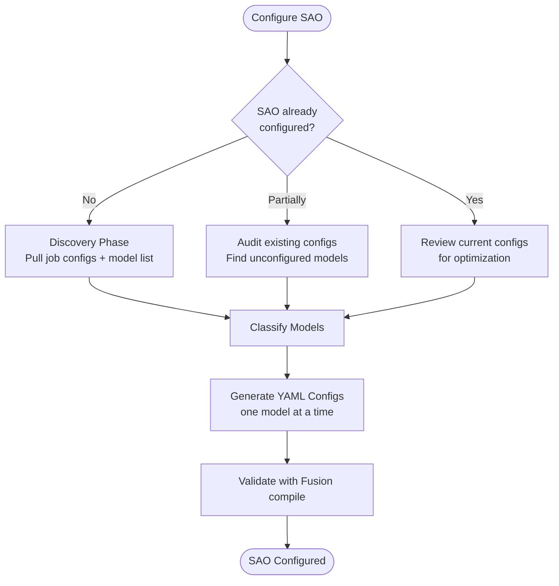

# Configure State-Aware Orchestration

## Overview

State-Aware Orchestration (SAO) uses metadata to skip model rebuilds when upstream data hasn't changed, reducing compute costs. This skill walks through configuring SAO for a dbt project: discovering current state, classifying models, generating YAML configs, and validating them.

**Key principle:** Default to `updates_on: all` (rebuild only when ALL upstream dependencies have fresh data) for cost optimization. Escalate to `updates_on: any` only with business justification.

## Prerequisites

Before starting, confirm:

| Requirement | How to Check |
|-------------|-------------|
| Enterprise or Enterprise+ account | Ask user or check account settings |
| Fusion engine enabled on deployment environment | Check environment settings in dbt Cloud |
| Deploy job (not CI/merge job) | SAO only works on deploy jobs |
| SQL models only | Python models are not supported |

## Decision Flow



## Workflow

### Phase 1: Discovery

1. **Ask:** "Is SAO already configured in this project?"
2. **Check for existing freshness configs** in `dbt_project.yml` and model YAML files:
   - Search for `build_after` and `freshness` keys
3. **Use dbt MCP tools** to pull project context:
   - `get_all_models` — list all models with materializations
   - `get_lineage` — understand the dependency graph
   - `list_jobs` + `get_job_details` — see current job configs and schedules
4. **Read model files** to understand:
   - Materializations (view, table, incremental)
   - Source dependencies vs model dependencies
   - Tags, contracts, access levels, groups
5. **Check source table types** — if warehouse access is available (via `execute_sql` MCP tool), query `information_schema.tables` to determine whether each source is a table or a view. This affects freshness configuration.
6. **Build a model inventory** — a table of every model with its layer, materialization, upstream count, and downstream count

### Phase 2: Classification

For each model, determine the appropriate `updates_on` setting. Default the project to `all`. See [Model Classification Guide](references/model-classification-guide.md).

**Quick classification rules:**

| Pattern | Recommended `updates_on` | Reasoning |
|---------|--------------------------|-----------|
| Staging views over sources | `all` or not configured | Staging views select 1 to 1 to sources; configure if it gates expensive downstream work |
| Intermediate views (fan-out hub) | `all` or `any` depending on role | Views that gate many downstream models are SAO leverage points — `build_after` throttles downstream churn |
| Intermediate views (simple passthrough) | Often not configured | Low fan-out, cheap downstream — usually not worth configuring |
| Mart tables with multiple sources | `all` | Wait for all upstream data before rebuilding |
| Fact tables serving dashboards | `any` or `all` depending on urgency | Business-critical may need faster refresh |
| Dimension tables (slowly changing) | `all` with longer period | Dimensions change infrequently |
| Incremental models | `all` | Most cost-sensitive; skip when no new data |
| Models with `access: public` | Discuss with user | External consumers may have SLA expectations |

**Present recommendations** to the user in a table before proceeding:

```
| Model | Layer | Materialization | Recommendation | Reasoning |
|-------|-------|-----------------|----------------|-----------|
| dim_roster | mart | table | build_after: 4h, all | Dimension, infrequent changes |
| fct_player_salaries | mart | table | build_after: 1h, any | Fact table, serves metrics |
```

**Always ask for confirmation** before applying configs. Flag any models you're unsure about.

### Phase 3: Configuration

Generate YAML configs incrementally — one model or layer at a time.

**Where to put configs (in order of preference):**

1. **Project-level defaults** in `dbt_project.yml` — for broad settings across layers
2. **Model YAML** in `models/<layer>/schema.yml` — for per-model overrides
3. **SQL `config()` block** — only when the user specifically requests it

See [YAML Structure Reference](references/yaml-structure.md) for exact syntax at each level.

**Configuration approach:**

1. Configure source freshness first — this captures upstream metadata that drives SAO
2. Start with project-level defaults in `dbt_project.yml`
3. Add per-layer overrides under the project name hierarchy
4. Add per-model overrides only where classification differs from the layer default

**Show diffs** before writing any file. Explain what each config does.

### Phase 4: Validation

After each configuration change:

1. **Run `dbt compile`** (via Fusion or CLI) to check for syntax errors
2. **Review the compiled output** for unexpected behavior
3. **Check source freshness configs** resolve correctly
4. **Verify** `build_after` intervals make sense for the job schedule

See [Fusion Validation](references/fusion-validation.md) for validation steps.

## Source Freshness Configuration

**Recommended:** Configure source freshness even if it's not strictly required. Source freshness captures metadata that drives SAO all the way upstream — without it, Fusion has limited visibility into when source data actually changed, reducing SAO's effectiveness.

Source freshness can be configured at two levels:
1. **Source-level default** — applies to all tables under that source (in the YAML file where sources are defined, or in `dbt_project.yml`)
2. **Table-level override** — per-table settings in the source YAML file

### Determine if Sources Are Tables or Views

Before configuring freshness, check whether each source is an actual table or a database view. This matters because **Fusion treats views as "always fresh"** — it cannot determine freshness from view metadata alone.

**How to check:** If you have access to the warehouse (via `execute_sql` MCP tool or CLI), run an information schema query:

```sql
select table_name, table_type
from information_schema.tables
where table_schema = '<source_schema>'
  and table_name in ('<table1>', '<table2>')
```

You cannot determine this from the YAML files alone.

| Source Type | Freshness Behavior | Action |
|-------------|-------------------|--------|
| **Table** | Fusion can detect freshness from warehouse metadata automatically | Source freshness config is recommended but not strictly required |
| **View** | Fusion treats it as "always fresh" (with warning) | **Must** configure `loaded_at_field` or `loaded_at_query` for SAO to work correctly |

### Configuring Source Freshness

Set a default across all tables in a source, then override per-table as needed:

```yaml
sources:
  - name: raw_data
    config:
      freshness:
        warn_after: {count: 12, period: hour}
        error_after: {count: 24, period: hour}
      loaded_at_field: _etl_loaded_at    # default for all tables
    tables:
      - name: orders                      # inherits source-level config
      - name: events_view
        loaded_at_query: |                # override for this table
          select max(event_timestamp)
          from {{ this }}
          where event_timestamp >= current_timestamp - interval '3 days'
      - name: legacy_table
        config:
          freshness: null                 # opt out if not needed
```

**Two approaches for detecting freshness:**

| Method | Use When | Example |
|--------|----------|---------|
| `loaded_at_field` | Source has a reliable timestamp column (e.g., `_etl_loaded_at`, `updated_at`) | `loaded_at_field: _etl_loaded_at` |
| `loaded_at_query` | No reliable timestamp column, need custom logic, or late-arriving data | `loaded_at_query: "select max(ingested_at) from {{ this }}"` |

**Rules:**
- Use one or the other per table, never both
- At least `warn_after` or `error_after` must be set for freshness checks to run
- `loaded_at_query` supports a `filter` for expensive full-table scans

See [SAO Fundamentals](references/sao-fundamentals.md) for details on how freshness detection works.

## Key Gotchas

| Issue | Impact | Fix |
|-------|--------|-----|
| Python models | SAO doesn't support them | Skip; document as limitation |
| Database views as sources | Treated as "always fresh" without explicit freshness config | Add `loaded_at_field` or `loaded_at_query` |
| CI/merge jobs | SAO not supported | Only configure for deploy jobs |
| Late-arriving data with `loaded_at_field` | May miss records | Use `loaded_at_query` with lookback window matching incremental model |
| `freshness: null` on a model | Opts out of inherited build_after | Use intentionally to exclude specific models |
| `updates_on` does not support Jinja | Cannot use `{{ var() }}` | Must be a literal `any` or `all` |

## Common Mistakes

| Mistake | Why It's Wrong | Correct Approach |
|---------|----------------|------------------|
| Putting `build_after` under `meta.sao` | Not a valid config path | Use `config.freshness.build_after` in model YAML or `+freshness.build_after` in `dbt_project.yml` |
| Assuming views never need `build_after` | Views that are fan-out hubs or coherence points DO benefit from `build_after` — it controls when downstream work triggers | Evaluate views as DAG control points; configure if they gate expensive or numerous downstream models |
| Using both `loaded_at_field` and `loaded_at_query` | Only one is allowed | Pick the appropriate one for your source |
| Listing upstream model names in `build_after` | `build_after` is a time interval, not a dependency list | Use `count` + `period` to define the interval |
| Configuring SAO on CI jobs | CI/merge jobs don't support SAO | Only use deploy jobs |
| Setting very short `build_after` periods | Defeats the purpose of cost savings | Align with actual data refresh frequency |

## References

- [SAO Fundamentals](references/sao-fundamentals.md) — Core concepts and how SAO works
- [Job Config Extraction](references/job-config-extraction.md) — Using MCP tools to pull job metadata
- [Dependency Analysis](references/dependency-analysis.md) — Analyzing the model DAG
- [Model Classification Guide](references/model-classification-guide.md) — Decision framework for `updates_on`
- [YAML Structure](references/yaml-structure.md) — Complete syntax reference for all config locations
- [Iterative Configuration](references/iterative-configuration-approach.md) — Step-by-step workflow patterns
- [Fusion Validation](references/fusion-validation.md) — Validating configs with Fusion compile
